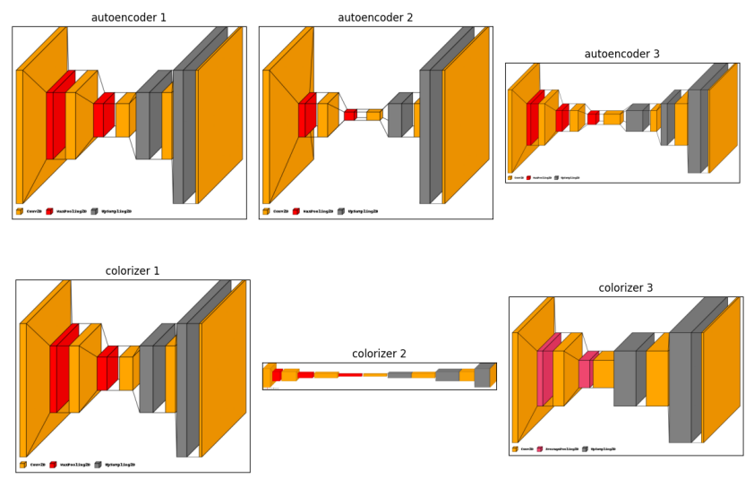

# Autoencoders for Colorization

Autoencoders are a special type of deep learning architecture consisting of two networks: anencoder and a decoder. The encoder, through a series of convolutional neural networks (CNN) anddownsampling, learns a reduced dimensional representation of the input data. In contrast, thedecoder, using CNN and upsampling, attempts to regenerate the data from these representations. Awell-trained autoencoder can regenerate data that is identical or as close as possible to the originalinput. Autoencoders are versatile and have been used for various applications such as anomalydetection, denoising images, and colorizing images. In this study, the focus is on utilizingautoencoders to colorize landscape images.

# Data preparation

We used the CIFAR-10 dataset, which consists of 60,000 color images in 10 differentclasses, each image sized at 32x32 pixels.
The first step was to convert these color images into grayscale. This was done tocreate a dataset of black and white images, which our models would then attempt tocolorize.

# Training

**Autoencoders training**

Autoencoders learned to compress and reconstruct colour images from the CIFAR-10 dataset.
The quality of reconstruction was gauged using a loss function, with lower values indicating better performance.

**Colorizer training**

After the autoencoders, colorizers were trained to apply colour to grayscale images, trying to match the original colours.

# Conclusion

Based on the results, the project demonstrates that convolutional autoencoders and colorizers canindeed learn to reconstruct and colorize images to a certain extent. Autoencoder 1 and Colorizer 3have shown the most promise, with steady improvement and good generalization to new images.However, there's room for improvement in all models, particularly in enhancing their ability tohandle images they haven't seen before.

# Usage

1) To train a model open the model_train.ipynb file with jupyter-lab
2) Select a model function from the models.py file to construct the model
3) To view the experiment results simply just open the experimens.ipynb file and run it on jupyter-lab
4) Do a pip install of Pillow and visualkeras